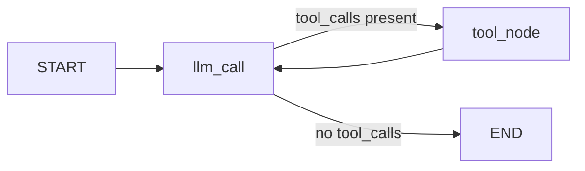

# langgraph-dishes

> Small, self-contained LangGraph experiments. Each dish is a working agent or workflow pattern built from scratch.


---

## Dishes so far

### Arithmetic ReAct Agent
> `dry-run/quickstart.py`

A minimal ReAct agent that routes arithmetic queries to the right tool, loops back for multi-step reasoning, and summarizes results naturally.

**Tools:** `add`, `subtract`, `multiply`, `divide`

**Graph:**



**Sample runs:**

```
Human:  Add 3 and 10
AI:     [calls add(3, 10)]
Tool:   13
AI:     The sum of 3 and 10 is 13.

Human:  What is 144 divided by 12?
AI:     [calls divide(144, 12)]
Tool:   12.0
AI:     144 divided by 12 is 12.
```

---

## Stack

| Component | Version |
|---|---|
| Python | 3.12 |
| LangGraph | latest |
| LangChain OpenAI | latest |
| Langfuse | latest |
| OpenAI model | gpt-4o-mini |

---

## Setup

```bash
python -m venv agentic-env
agentic-env\Scriptsctivate   # Windows
pip install -r requirements.txt
cp .env.example .env            # add your API keys
```

---

## Structure

```
langgraph-dishes/
├── dry-run/          # day 0 experiments
│   └── quickstart.py # arithmetic ReAct agent
├── requirements.txt
├── .env.example
└── README.md
```

---

*More dishes coming. WIP.*